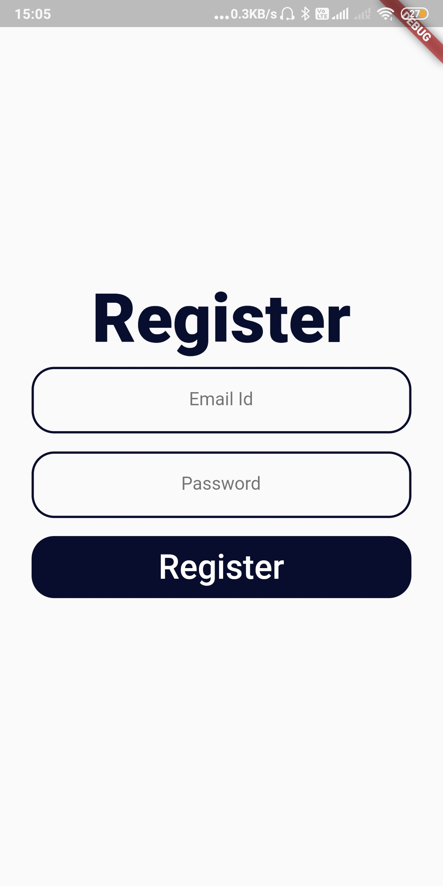

## Doc_Case App Flutter 

An app for digitalising medical documents.
This app lets you keep all the health related documents with you, whenever you go, wherever you go.
Its hard for people to maintain their documents realted to their health and their doctor prescriptions.This app help you to digitalise all the important documents so that you can easily access it whenever you need it.

## Screenshots

| Sign In Page | Register Page | Home Page  |
| --- | --- | --- |
| |||

## Apk Drive Link
https://drive.google.com/drive/folders/1kaUMyGFId_B312-gMJLIFL9b1q5Il_o1?usp=sharing

## Getting Started

This project is a starting point for a Flutter application.

A few resources to get you started if this is your first Flutter project:

- [Lab: Write your first Flutter app](https://flutter.dev/docs/get-started/codelab)
- [Cookbook: Useful Flutter samples](https://flutter.dev/docs/cookbook)

For help getting started with Flutter, view our
[online documentation](https://flutter.dev/docs), which offers tutorials,
samples, guidance on mobile development, and a full API reference.
